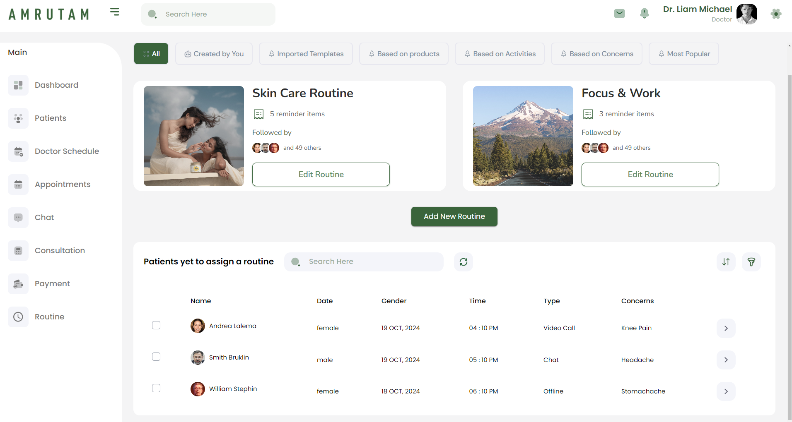

# Routine Dashboard for Doctors - Amrutam Pharmaceuticals

This project is part of Amrutam Pharmaceuticals. It provides routine dashboard for doctors to manage their routines, patients, and other related tasks.



## Table of Contents

- [Installation](#installation)
- [Running the Project](#running-the-project)
- [Building the Project](#building-the-project)
- [Project Structure](#project-structure)
- [Contributing](#contributing)
- [License](#license)

## Installation

Follow these steps to set up the project on your local machine:

### Prerequisites

Ensure you have the following software installed on your local machine:

- [Node.js](https://nodejs.org/) (version 14.x or higher)
- [npm](https://www.npmjs.com/) (version 6.x or higher) or [Yarn](https://yarnpkg.com/) (version 1.x or higher)

### Clone the Repository

```bash
git clone https://github.com/subarnabsadhukhan/Routine-Dashboard-for-Doctors.git
cd Routine-Dashboard-for-Doctors
```

### Install Dependencies

Using npm:

```bash
npm install
```

Or using Yarn:

```bash
yarn install
```

## Running the Project

To run the project locally, use the following command:

Using npm:

```bash
npm run dev
```

Or using Yarn:

```bash
yarn dev
```

This will start the development server and you should see an output similar to:

```bash
VITE v2.x.x  ready in x.xs

  ➜  Local:   http://localhost:3000/
  ➜  Network: use --host to expose
```

Open your browser and navigate to `http://localhost:3000/` to see the application running.

## Building the Project

To create an optimized production build, use the following command:

Using npm:

```bash
npm run build
```

Or using Yarn:

```bash
yarn build
```

The output will be in the `dist` directory. You can serve this directory using a static server or deploy it to a hosting provider.

## Project Structure

The project is structured as follows:

- `src/` - Contains the source code of the application.
  - `App.jsx` - Main App component.
  - `main.jsx` - Entry point for the application.
  - `assets/` - Assets such as images, fonts, etc.
  - `components/` - Reusable components.
  - `pages/` - Page components.
  - `ui/` - UI components.
  - `context/` - Context providers.
  - `hooks/` - Custom React hooks.
- `public/` - Static assets.
- `index.html` - Main HTML file.
- `package.json` - npm/Yarn dependencies and scripts.
- `README.md` - Project documentation.
- `vite.config.js` - Vite configuration file.

## Contributing

If you would like to contribute to this project, please follow these steps:

1. Fork the repository.
2. Create a new branch (`git checkout -b feature-branch-name`).
3. Make your changes.
4. Commit your changes (`git commit -m 'Add some feature'`).
5. Push to the branch (`git push origin feature-branch-name`).
6. Open a pull request.
